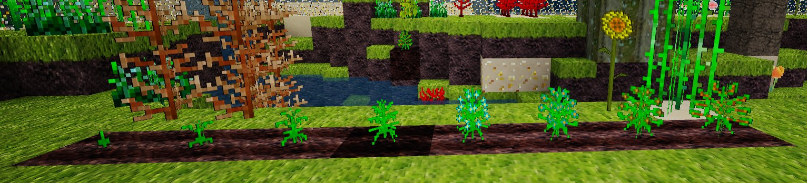
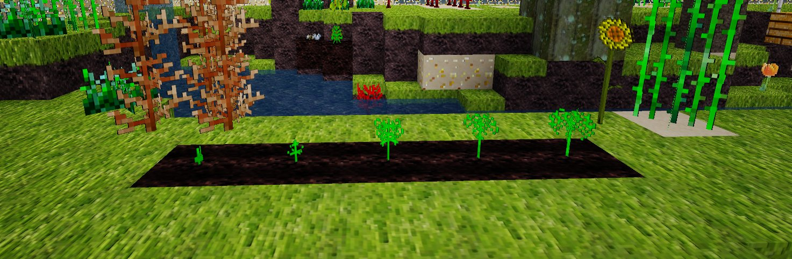
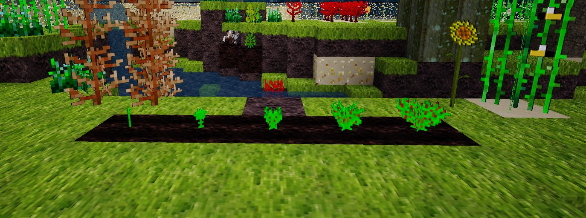
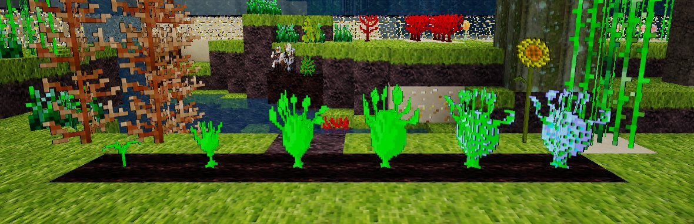
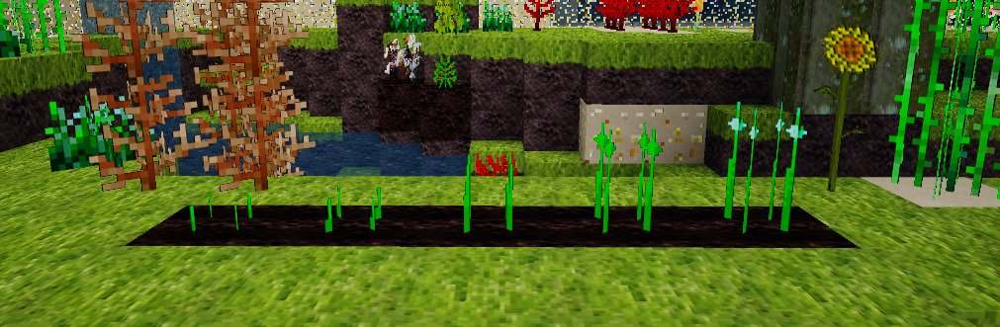
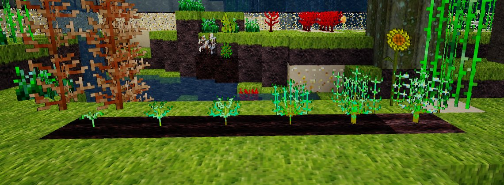
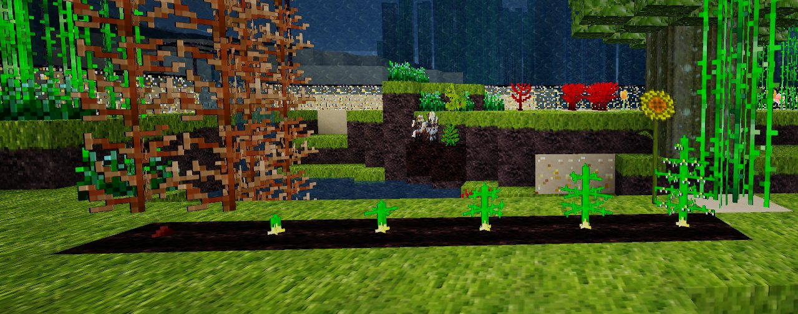
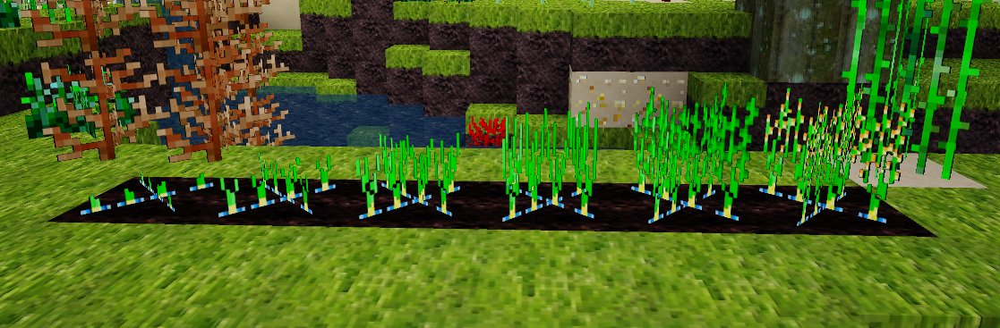
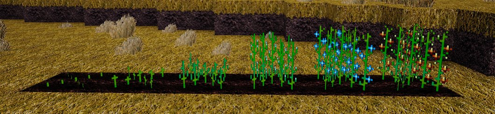
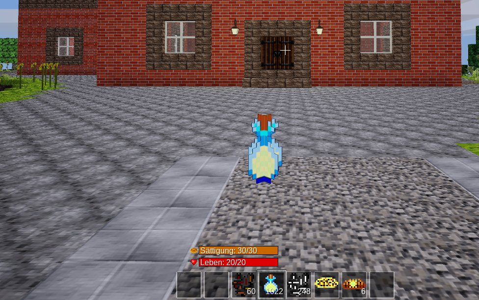

# Cucina Vegana

This Mod adds some new Plants for vegan cooking in Minetest.
It supports farming and farming_redo from TenPlus.

## Soy

 
## Parsley

 
## Lettuce

 
## Kohlrabi

 
## Chives

 
## Rosemary

 

## Asparagus

 

## Rice

 

## Flax

 

## Peanut

 

## The Mod vegan_sunflower is integrated in Cucina Vegana.

## Install

Move your Download to the Mods-Folder.

## Depends

default 
dye 
farming 
vessels 

### optional

aqua_farming 
basic_materials 
bbq 
bees 
bonemeal 
bucket 
building_blocks 
bushes 
bushes_classic 
clementinetree 
cottages 
diet 
farming_redo 
farming_nextgen 
fishing 
flowers 
homedecor 
hunger 
hunger_ng 
intllib 
lemontree 
mobs 
moreblocks 
petz 
pizza 
ropes 
signs_bot 
techage 
technic 
wine 
wool 

## License

License: LGPL3.0

